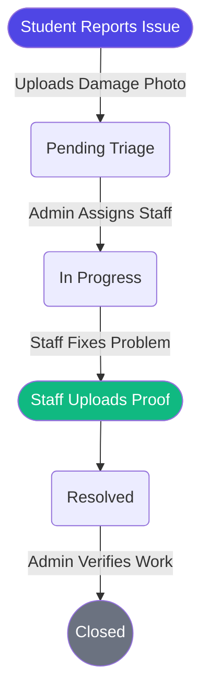
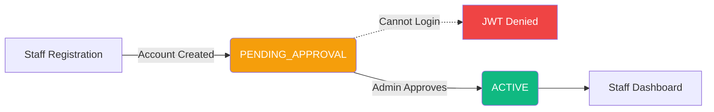
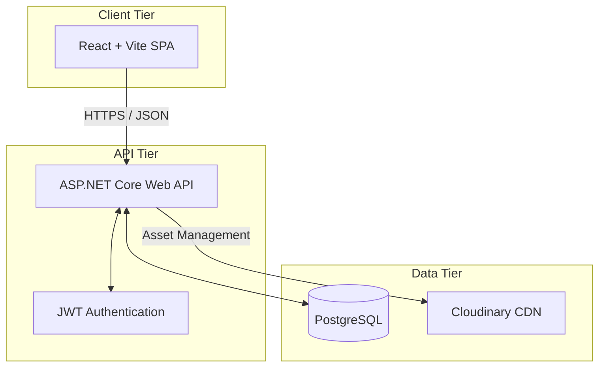

<div align="center">
  
  
  <h1 align="center">FixIt — Campus Management System</h1>
  
  <p align="center">
    <strong>A centralized campus issue management platform connecting students, staff, and administrators to streamline issue reporting, resolution, evidence collection, and administrative oversight.</strong>
  </p>

  <p align="center">
    <a href="https://fixit-frontend-ednk.onrender.com">Live Demo</a>
    ·
    <a href="#-key-features">Features</a>
    ·
    <a href="#-api-overview">API</a>
    ·
    <a href="#-local-development">Getting Started</a>
  </p>

  <p align="center">
    
    
    
    
    
    
  </p>
</div>

<hr />

## 🚀 Live Demo

Experience the live application hosted on Render. *(Note: The initial load may take up to 30 seconds due to Render's free tier cold starts).*

- 🖥️ **Frontend Application:** [https://fixit-frontend-ednk.onrender.com](https://fixit-frontend-ednk.onrender.com)
- ⚙️ **Backend API (Swagger/Health):** [https://fixit-backend-ofjg.onrender.com/health](https://fixit-backend-ofjg.onrender.com/health)

> ⚠️ **Note:** Production credentials and secrets are intentionally omitted from this repository.

---

## 📌 Overview

**FixIt** replaces outdated email threads, verbal complaints, and paper trails with a fully digital, transparent, and accountable maintenance workflow.

By leveraging **photographic evidence** and **strict role-based authorization**, the platform ensures that campus facilities are maintained proactively. Students can report problems in under 30 seconds, staff can efficiently track their assigned workloads, and administrators gain a birds-eye view of campus health.

### 👥 User Roles & Responsibilities

| Role | Access Level | Responsibilities |
|:---:|:---|:---|
| 🎓 **Student** | Standard User | Register accounts, report campus issues, upload photographic evidence of damage, and track issue statuses. |
| 🧑‍🔧 **Staff** | Restricted | Manage assigned maintenance tasks, mark issues as resolved, and upload resolution proof photos. Requires Admin approval to log in. |
| 👨‍💼 **Admin** | Privileged | Command Center oversight. Approve/disable staff accounts, reassign issues, and verify maintenance resolutions. |

---

## ✨ Key Features

### 🎓 For Students
- **Rapid Issue Reporting:** Submit maintenance requests with titles, detailed descriptions, categories, and specific building locations.
- **Photographic Evidence:** Upload real-time photos of the issue to eliminate ambiguity.
- **Status Tracking:** Monitor issues as they transition from *Pending Triage* ➡️ *Assigned* ➡️ *In Progress* ➡️ *Resolved*.

### 🧑‍🔧 For Maintenance Staff
- **Secure Onboarding:** Dedicated staff registration that remains sandboxed until explicitly approved by an administrator.
- **Task Management Board:** View a personalized dashboard of assigned issues, complete with priority levels (e.g., Critical, High, Routine).
- **Proof of Work:** Upload "after" photos to definitively prove an issue has been resolved, updating the status for admin verification.

### 👨‍💼 For Administrators
- **Staff Governance:** Complete control over staff accounts (Approve, Disable, Enable, Remove).
- **Command Center Dashboard:** High-level metrics showing open issues, critical emergencies, and resolution rates.
- **Quality Assurance Verification:** Review staff resolution evidence before officially marking an issue as *Closed*.

---

## 🔄 Core Workflows

### 1. Issue Lifecycle



### 2. Staff Onboarding Authorization



---

## 🏗️ Architecture

FixIt uses a decoupled client-server architecture with a clear separation of concerns, heavily utilizing RESTful principles.



### 🧰 Technology Stack

| Category | Technology |
|---|---|
| **Frontend UI** | React 18, TypeScript, Tailwind CSS, Vite |
| **Backend API** | ASP.NET Core 8, C# 12 |
| **Data Access** | Entity Framework Core (EF Core) |
| **Database** | PostgreSQL 15 |
| **Authentication** | JSON Web Tokens (JWT), BCrypt Password Hashing |
| **Storage** | Cloudinary (Production), Local File System (Development) |
| **DevOps** | Docker, Docker Compose, Render |

---

## 📁 Project Structure

```text
FixIt-Campus-Management/
├── frontend/                 # React & Vite application
│   ├── src/
│   │   ├── components/       # Reusable UI components
│   │   ├── contexts/         # React Context (Auth, etc.)
│   │   ├── layouts/          # Dashboard & Public layouts
│   │   ├── pages/            # View components for routes
│   │   ├── services/         # Axios API implementations
│   │   └── types/            # TypeScript interfaces
│   └── package.json
├── backend/                  # ASP.NET Core Web API
│   ├── Controllers/          # API Route endpoints
│   ├── Data/                 # EF Core DbContext & Seeding
│   ├── DTOs/                 # Data Transfer Objects
│   ├── Models/               # Entity Framework models
│   ├── Services/             # Storage providers & business logic
│   ├── Program.cs            # Startup & Configuration
│   └── Dockerfile            # Backend container definition
├── render.yaml               # Render Infrastructure as Code Blueprint
├── docker-compose.yml        # Local development orchestration
└── README.md                 # Project documentation
```

---

## 🔌 API Overview

The backend exposes a comprehensive RESTful API under the `/api` prefix. All sensitive endpoints require Bearer Token authorization.

### Authentication & Authorization (`/api/auth`)
| Method | Endpoint | Description | Auth Required |
|---|---|---|:---:|
| `POST` | `/api/auth/register` | Register a new student or staff member | ❌ |
| `POST` | `/api/auth/login` | Authenticate and retrieve a JWT | ❌ |

### Staff Management (`/api/admin/staff`)
| Method | Endpoint | Description | Auth Required |
|---|---|---|:---:|
| `GET` | `/api/admin/staff` | Retrieve staff roster and statistics | `[ADMIN]` |
| `POST` | `/api/admin/staff/{id}/approve` | Approve a pending staff account | `[ADMIN]` |
| `POST` | `/api/admin/staff/{id}/disable` | Suspend staff access | `[ADMIN]` |
| `POST` | `/api/admin/staff/{id}/remove` | Permanently remove a staff member | `[ADMIN]` |

*(Other extensive endpoints for Issues, Evidence, Categories, and Locations are similarly protected based on Role-Based Access Control).*

---

## 🔐 Security & Data Integrity

- **JWT Authentication:** Stateless, scalable authentication using signed JSON Web Tokens.
- **Strict Role-Based Authorization (RBAC):** Backend endpoints rigorously check roles (`STUDENT`, `STAFF`, `ADMIN`) before processing requests.
- **Cryptographic Hashing:** All passwords are salted and hashed using `BCrypt`.
- **Environment Isolation:** Sensitive credentials (DB strings, Cloudinary URLs, JWT secrets) are entirely decoupled from the codebase using environment variables.
- **Idempotent Migrations:** Database schemas are safely and automatically scaffolded upon deployment.

---

## 🚀 Local Development

Follow these instructions to run FixIt locally on your machine.

### Prerequisites
- Node.js (v18+) and npm
- .NET 8.0 SDK
- Docker & Docker Compose
- Git

### 1. Clone the Repository
```bash
git clone <your-repo-url>
cd FixIt-Campus-Management
```

### 2. Environment Variables Setup
Create the required configuration files based on the `.example` files (or place these variables in your system environment):

**Backend (`backend/appsettings.Development.json`):**
```json
{
  "ConnectionStrings": {
    "DefaultConnection": "Host=localhost;Database=fixit_db;Username=postgres;Password=your_password"
  },
  "Jwt": {
    "Key": "your_super_secret_jwt_key_that_is_long_enough",
    "Issuer": "FixItApp",
    "Audience": "FixItUsers"
  },
  "STORAGE_PROVIDER": "Local" 
}
```

**Frontend (`frontend/.env`):**
```env
VITE_API_BASE_URL=http://localhost:5000/api
```

### 3. Run with Docker Compose (Easiest)
Spin up the entire stack (Database, Backend) with a single command:
```bash
docker compose up --build
```
- PostgreSQL and Backend API will be available at `http://localhost:5000`

### 4. Run Frontend Manually
```bash
cd frontend
npm install
npm run dev
```

---

## ☁️ Deployment Strategy

FixIt is engineered for immediate deployment on **Render** using a predefined Blueprint (`render.yaml`).

| Service | Render Configuration | Role |
|---|---|---|
| **PostgreSQL** | Free Tier Database | Relational Data Storage |
| **Backend** | Docker Web Service | Hosts the ASP.NET Core API |
| **Frontend** | Static Site | Serves the optimized Vite React build |

Production Evidence is automatically routed to **Cloudinary** via the backend's `IFileStorageService` abstraction.

---

## 🔮 Future Roadmap

We are constantly looking to improve the campus experience. Planned features include:
- [ ] 📧 **Email Notifications:** Automated alerts when issue statuses change.
- [ ] 🗺️ **Interactive Campus Map:** Visual heatmaps of reported issues based on location data.
- [ ] ⏱️ **SLA Tracking:** Automatic escalations for critical issues that aren't resolved within 24 hours.
- [ ] 📱 **Progressive Web App (PWA):** Native-like mobile experience for reporting on the go.

---

## 🤝 Contributing

Contributions make the open-source community an amazing place to learn, inspire, and create. Any contributions you make are **greatly appreciated**.

1. **Fork** the Project
2. **Create** your Feature Branch (`git checkout -b feature/AmazingFeature`)
3. **Commit** your Changes (`git commit -m 'feat: Add some AmazingFeature'`)
4. **Push** to the Branch (`git push origin feature/AmazingFeature`)
5. **Open** a Pull Request

> ⚠️ Please ensure you do not commit any `.env` files, secrets, or `uploads/` directories.

---

<div align="center">
  <p>Built with ❤️ for Campus Communities</p>
</div>
